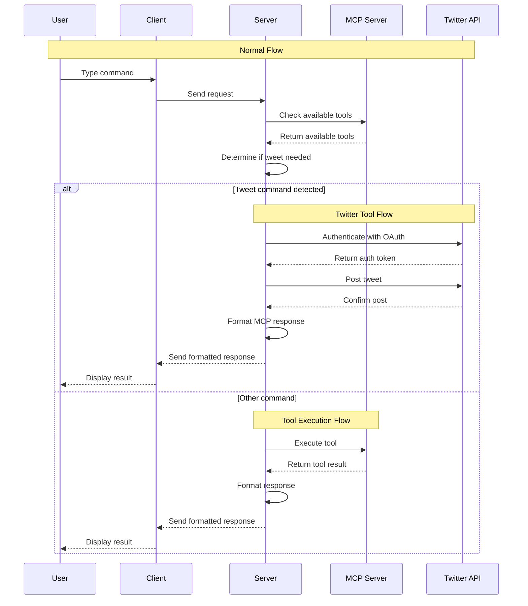

# AI Agent

An AI-powered assistant that interacts with users via the command line, processes inputs using Google's Gemini API, and executes tasks through Model Context Protocol (MCP) tools. It also integrates with the Twitter(X) API to post updates directly from the AI agent.

## Features

- **Conversational Interface**: Engage in a chat-like experience through the terminal.
- **AI Integration**: Utilizes Google's Gemini API for generating intelligent responses.
- **Tool Execution**: Connects with MCP tools to perform specific actions based on user input.
- **Twitter(X) Integration**: Directly post updates to Twitter(X).
- **Extensible Design**: Easily add or modify tools to expand functionality.

## Getting Started

### Prerequisites

- **Node.js** (v18 or higher)
- **npm** (Node Package Manager)
- **Google Gemini API Key**
- **Twitter(X) API credentials**: app key, app secret, access token, and access secret.
- **MCP Server** running locally on port `3001`.

### Installation

1. **Clone the Repository**:

   Clone the repository to your local machine and navigate to the project directory:

   ```bash
   git clone https://github.com/Pranaysherkar/AI-agent.git
   cd AI-agent
   ```

2. **Install Dependencies**:

   #### Server:

   Navigate to the server directory and install the necessary dependencies:

   ```bash
   cd server
   npm install
   ```

   #### Client:

   Navigate to the client directory and install the necessary dependencies:

   ```bash
   cd ../client
   npm install
   ```

3. **Configure Environment Variables**:

   Create a `.env` file in the root directory and add your API keys:

   ```env
   GEMINI_API_KEY=your_gemini_api_key_here
   Twitter(X)_API_KEY=your_Twitter(X)_api_key_here
   Twitter(X)_API_SECRET=your_Twitter(X)_api_secret_here
   Twitter(X)_ACCESS_TOKEN=your_Twitter(X)_access_token_here
   Twitter(X)_ACCESS_SECRET=your_Twitter(X)_access_secret_here
   ```

4. **Start the MCP Server**:

   Ensure that your MCP server is running locally on http://localhost:3001/sse.

5. **Run the AI Agent**:

   #### Start the Server:

   In the server directory, run the following command to start the server:

   ```bash
   node index.js
   ```

   #### Start the Client:

   In the client directory, run the following command to start the client:

   ```bash
   node index.js
   ```

## Usage

Interact: Type your questions or commands in the terminal.

Tool Invocation: The AI will automatically determine if a tool needs to be executed based on your input.

Continuous Conversation: The chat history is maintained for context-aware interactions.

Twitter(X) Integration: The agent can post to Twitter(X) using the provided credentials.

## Project Structure

### Server

* `index.js`: Main server file that connects to the Model Context Protocol (MCP) server and handles tool execution.
* 
* `package.json`: Contains server-specific dependencies and configurations.
* `.env`: Contains environment variables for API keys and credentials.

### Client

* `index.js`: Main client file that communicates with the AI agent and handles user interactions.
* `mcp.tool.js`: Contains the logic for interacting with the Twitter API, authenticating, and posting tweets based
* `package.json`: Contains client-specific dependencies and configurations.
* `.env`: Contains environment variables for API keys and credentials.

## Contributing

Contributions are welcome! Please fork the repository and submit a pull request with your enhancements.


